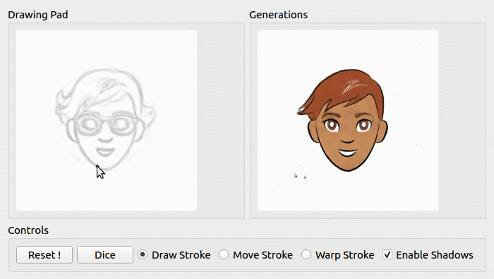
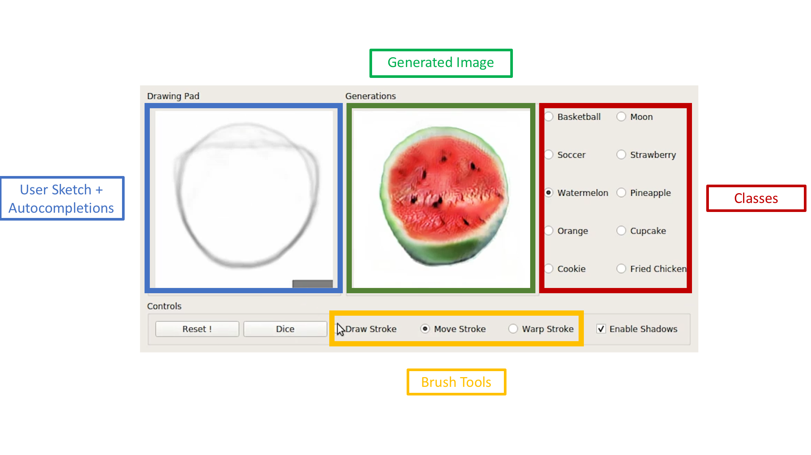

<br><br><br>

# iSketchNFill

We propose an interactive GAN-based sketch-to-image translation method
that helps novice users easily create images of simple objects.
The user starts with a sparse sketch and a desired object category, and the network then recommends its plausible completion(s) and shows a corresponding synthesized image. This enables a feedback loop, where the user can edit the sketch based on the network's recommendations, while the network is able to better synthesize the image that the user might have in mind.
In order to use a single model for a wide array of object classes, we introduce a gating-based approach for class conditioning, which allows us to generate distinct classes without feature mixing, from a single generator network.

#### iSketchNFill: [[Project]](https://arnabgho.github.io/iSketchNFill/) [[Paper]](http://www.robots.ox.ac.uk/~tvg/publications/2019/ICCV_ISF_camera_ready.pdf)


## Prerequisites
- Linux or macOS
- Python 3
- CPU or NVIDIA GPU + CUDA CuDNN

## Getting Started
- Clone this repo:
```
git clone https://github.com/arnabgho/iSketchNFill
cd iSketchNFill
```
- Install PyTorch 1.0+ and dependencies from http://pytorch.org
- Install Torchvision
- Install all requirements
```
pip install -r requirements.txt
```


### Interactive session with a pre-trained model (iSketchNFill)

<p align="center">
  
</p>

- Download pretrained model (Scribble Dataset)


```
bash scripts/download_pretrained_scribble_dataset.sh
```

- Play with the interface

```
python main_gui_shadow_draw_color.py --name wgangp_sparse_label_channel_pix2pix_autocomplete_multiscale_nz_256_nc_1_nf_32_gp_0_multigpu --model sparse_wgangp_pix2pix  --checkpoints_dir checkpoints_sparse --gpu_ids 0 --nz 256 --sparseSize 4 --fineSize 128 --ngf 32 --ndf 32 --num_interpolate 8 --input_nc 1 --output_nc 1
```

- One can change the number of shadows with the parameter --num_interpolate
- One can change the quality of the completed results by varying the standard deviation --test_std, lower values indicate higher quality while higher values indicate lower quality completions.

### Sketchy dataset

```
bash scripts/download_pretrained_sketchy_dataset.sh
```

```
python main_gui_shadow_draw_sketchy.py --name wgangp_sparse_label_channel_pix2pix_autocomplete_multiscale_nz_256_nc_1_nf_32_gp_0 --model sparse_wgangp_pix2pix --checkpoints_dir checkpoints_sparse_sketchy --gpu_ids 0 --nz 256 --sparseSize 4 --fineSize 128 --ngf 32 --ndf 32 --num_interpolate 8  --input_nc 1 --output_nc 1 --n_classes 6
```
### Sketching Car Outlines
```
bash scripts/download_pretrained_car_outlines.sh
```

```
python main_gui_shadow_draw_sketch.py --name wgangp_sparse_label_channel_pix2pix_autocomplete_multiscale_nz_256_nc_1_nf_32_gp_0 --model sparse_wgangp_pix2pix --checkpoints_dir checkpoints_sparse_cars_outlines --gpu_ids 0 --nz 256 --sparseSize 4 --fineSize 128 --ngf 32 --ndf 32 --num_interpolate 6  --input_nc 1 --output_nc 1 --n_classes 1 --test_std 0.8
```

***
### Sketch Emojis

<p align="center">
  
</p>

```
bash scripts/download_pretrained_emoji.sh
```

```
python main_gui_shadow_draw_pix2pix.py --name wgangp_sparse_label_channel_pix2pix_autocomplete_multiscale_nz_256_nc_1_nf_32_gp_0_multigpu --model sparse_wgangp_pix2pix  --checkpoints_dir checkpoints_sparse_emoji --gpu_ids 0 --nz 256 --sparseSize 4 --fineSize 128 --ngf 32 --ndf 32 --num_interpolate 8 --input_nc 1 --output_nc 1 --checkpoints_dir_pix2pix ./checkpoints --name_pix2pix scribble2emoji --model_pix2pix pix2pixhd --n_classes 1
```
***
# Interface



## Layout

* **Drawing Pad**: The main window of the interface where the user can draw with the left mouse button and erase with the right mouse button. The user has to keep the appropriate mouse button pressed to draw. The size of the brush can be altered by using the scroll bar on the mouse. As the user starts drawing the autocompletions help the user to draw.
* **Generations**: The window in which the final rendered RGB image from one of the autocompletions is displayed.
* **Classes**: The available classes are depicted in this window. The user can select a class and start drawing objects of that class.

## Control Panel

* **Reset**: This button resets the drawing panel so that the user can start sketching from scratch.
* **Dice**: This button changes the latent code for the generator, thus changing the shadow. The user can explore the dataset using this feature.
* **Draw Stroke**: This is the default mode whereby the user can sketch in the drawing pad.
* **Move Stroke**: This feature allows the user to select part of the sketch the user has drawn and move around to explore the various modes quickly. The size of the stroke grabbing area can be changed by using the scroll button in the mouse.
* **Warp Stroke**: An experimental feature whereby the user can warp the sketch using control points. The control points can be set using the right click button. Once the user has made all the control points he/she can put the cursor close to one of the points and drag to the desired position with the left mouse button pressed.
* **Enable Shadows**: This feature enables the multiple shadows to be overlayed with the the drawing pad. Otherwise only 1 autocompletion is shown.
***

#### Tips and Tricks for Using the Interface
* For some classes the brush can be made thinner for better feedback.
* If the user draws close to the shadows they can snap between modes such as go to different shapes of watermelons.
* With a small stroke the user can try to move the stroke to see possible autocompletions that depict different sizes/shapes of the object.

***
# New Features !

## Select Patches
<p align="center">
  
</p>

One can select patches from the autocompletions using the select patch option. One can cycle through the completions using the scroll button on the mouse and left click to select the patch.

Here we see that the user first chooses a completion with glasses, locks in the patch. The chin stroke is lowered until a beard appears. The user locks in this patch and moves on to the hair.

## Warp stroke
<p align="center">
  
</p>

Using [As Rigid as Possible](http://faculty.cs.tamu.edu/schaefer/research/mls.pdf) transformations on the stroke interesting manipulations can be made.

Here we see the user making control points at the edges of the stroke using the right click of the mouse. Then using the left click the user can drag the control point to change the shape of the watermelon.

***
# Scribble Dataset

Get the data
```
wget -N "http://www.robots.ox.ac.uk/~arnabg/scribble_dataset.zip"
```

***
## Train Sketch Autocomplete Models

### Emoji
Prepare the training data for training autocomplete model.
The original data for the emoji is from [Cartoon Set](https://google.github.io/cartoonset/download.html) collected by Google.
```
bash scripts/prepare_autocomplete_emoji.sh
```

Train the autocomplete model

```
python train.py --name wgangp_sparse_label_channel_pix2pix_autocomplete_multiscale_nz_256_nc_1_nf_32_gp_0_multigpu --model sparse_wgangp_pix2pix --dataroot ../data/autocomplete-cartoons/  --lambda_A 0.0 --lambda_GAN 1 --niter 800  --lr_d 1e-4 --lr_g 1e-4 --checkpoints_dir checkpoints_sparse_cartoons --batchSize 128 --gpu_ids 0 --save_epoch_freq 1 --nz 256 --sparseSize 4 --fineSize 128 --ngf 32 --ndf 32 --autocomplete_dataset_outline  --img_conditional_D --input_nc 1 --output_nc 1
```

### Scribble Dataset
Prepare the training data for training autocomplete model.
```
bash scripts/prepare_autocomplete_scribble_dataset.sh
```

Train the autocomplete model
```
python train.py --name wgangp_sparse_label_channel_pix2pix_autocomplete_multiscale_nz_256_nc_1_nf_32_gp_0_multigpu --model sparse_wgangp_pix2pix --dataroot ../data/autocomplete-scribble-dataset/  --lambda_A 0.0 --lambda_GAN 1 --niter 800  --lr_d 1e-4 --lr_g 1e-4 --checkpoints_dir checkpoints_sparse_scribble_dataset --batchSize 128 --gpu_ids 0 --save_epoch_freq 1 --nz 256 --sparseSize 4 --fineSize 128 --ngf 32 --ndf 32 --autocomplete_dataset_outline  --img_conditional_D --input_nc 1 --output_nc 1 --n_classes 10
```

### Tips for training

* Higher batch sizes provide very stable gradients and training, so utilize the maximum batch size you can. The training scripts are set to train on Multi-Gpus so utilize it.

* The [Zero Centred Gradient Penalty](https://arxiv.org/pdf/1801.04406.pdf) helps stabilize the training to a large extent.

* If the model diverges in your dataset, reduce the learning rate of the generator and discriminator to 1e-5. This can be useful in scenarios where you can only have smaller batch sizes.

* The preparation script first creates the required folders. It generates partial sketch images to simulate the different partial sketches the user will provide.

* In case one wants to train the autocomplete model on their own dataset, they have to first extract the edges using [Im2Pencil](https://github.com/Yijunmaverick/Im2Pencil). The edges need to be simplified using [Sketch Simplification](https://github.com/bobbens/sketch_simplification). Scripts for doing these 2 are coming.  

- Other datasets and training scripts coming soon !


## Citation
If you use this code for your research, please cite our paper.
```
@inproceedings{ghosh2019isketchnfill,
  title= {Interactive Sketch & Fill: Multiclass Sketch-to-Image Translation},
  author={Ghosh, Arnab and Zhang, Richard and Dokania, Puneet K. and Wang, Oliver and Efros, Alexei A. and Torr, Philip H. S. and Shechtman, Eli},
  booktitle={Proceedings of the IEEE international conference on computer vision},
  year={2019}
}
```
## Acknowledgement
Code is inspired by [pytorch-CycleGAN-and-pix2pix]( https://github.com/junyanz/pytorch-CycleGAN-and-pix2pix ). The UI is inspired by [iGAN](https://github.com/junyanz/iGAN). The pix2pixhd implementation is from [SPADE](https://github.com/NVlabs/SPADE). The warp functionality is from [Moving-Least-Squares](https://github.com/Jarvis73/Moving-Least-Squares).
